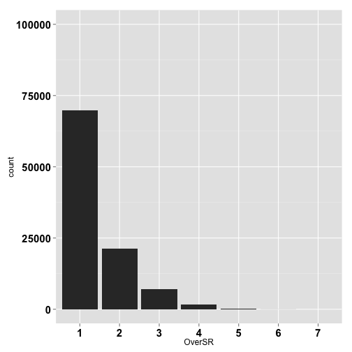
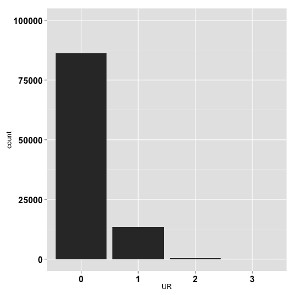
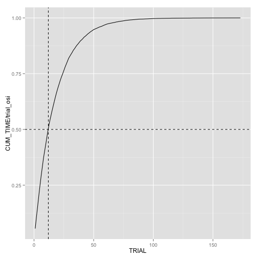

スクフェス: 11連(SR以上1枚確定)ガチャのシミュレーション
====
## はじめに

推しUR(0.4%の確率で引けるUR)を引くためには, 何回11連をまわせばいいのですかね? 

頭が悪いので, シミュレーションして調べてみました.


## シミュレーションの準備

```r
library(dplyr)
library(data.table)
library(ggplot2)
library(reshape2)
library(foreach)
library(doMC)
set.seed(12)
```

## ガチャのルール

推しURが0.4%, その他URが0.6%, SRは9%です. 

今回の実験では, 全部Rだった場合にのみ昇格が発生するとしました. 

実際には, ランダムでも昇格が発生するっぽい(よく分からん)ので, もうちょっとSR以上が多くなると思います. 

なので, 今回のシミュレーションでは, 実際より少し悪目の結果が出ると思います. 


```r
gacha = function(){
  gacha_result = runif(11) 
  osi_ur_num = gacha_result[gacha_result <= 0.004] %>% length ## UR
  ur_num = gacha_result[gacha_result > 0.004 & gacha_result <= 0.01] %>% length ## UR
  sr_num = gacha_result[gacha_result > 0.01 & gacha_result <= 0.1] %>% length ## SR
  
  ## 昇格
  if(osi_ur_num + sr_num + ur_num == 0){
    kakutei_gacha = runif(1)
    if(kakutei_gacha < 0.04){
      osi_ur_num = 1
    } else if(kakutei_gacha < 0.1){
      ur_num = 1
    } else {
      sr_num = 1
    }
  }
  return(c(OsiUR = osi_ur_num, UR = ur_num, SR = sr_num))
}
## 試しに引いてみます
gacha()
```

```
## OsiUR    UR    SR 
##     0     1     3
```

## ガチャのシミュレーション

10万回ガチャを引いてみました. 

```r
registerDoMC(4)
trial = 100000
res <- foreach(i = 1:trial, .combine = rbind) %dopar% gacha()
```

## SR以上が出る枚数

とりあえず, SR以上のカードが何枚ゲットできたかを調べてみましょう. 


```r
res_for_analysis = 
  res %>% as.data.table %>% 
  mutate(OverSR = UR + SR + OsiUR) 
res_for_analysis
```

```
##         OsiUR UR SR OverSR
##      1:     0  0  1      1
##      2:     0  0  1      1
##      3:     0  0  1      1
##      4:     0  0  1      1
##      5:     0  0  1      1
##     ---                   
##  99996:     0  0  1      1
##  99997:     0  0  1      1
##  99998:     0  0  1      1
##  99999:     0  1  0      1
## 100000:     0  0  1      1
```

```r
res_table = 
  res_for_analysis %>% 
  select(OverSR) %>% table

## 11連を回して出るSR以上の枚数の分布
res_table / sum(res_table)
```

```
## .
##       1       2       3       4       5       6       7 
## 0.69827 0.21263 0.07008 0.01635 0.00240 0.00025 0.00002
```

```r
## 出る枚数を棒グラフに
res_for_analysis %>% 
  ggplot(aes(x = OverSR))+ geom_histogram(aes(x=as.factor(OverSR))) + ylim(0,trial) + 
  theme(axis.text.x = element_text(face="bold", size=15, color="black")) + 
  theme(axis.text.y = element_text(face="bold", size=15, color="black")) 
```

 

約70%のガチャで, SR以上が1枚だけでした. 約7割ドブです. 結構高いです. 

## URが出る枚数

URが引ければ問題ありません. 

URが引けたガチャの割合をチェックします. 10万回引いて, 

```r
res_ur_table = 
  res_for_analysis %>% 
  mutate(UR = UR + OsiUR) %>% 
  select(UR) %>% unlist %>% table 
res_ur_prob_table = res_ur_table / sum(res_ur_table)

## 枚数と分布
res_ur_prob_table 
```

```
## .
##       0       1       2       3 
## 0.86150 0.13332 0.00510 0.00008
```

```r
res_for_analysis %>% 
  mutate(UR = UR + OsiUR) %>% 
  select(UR) %>% 
  ggplot(aes(x = UR)) + geom_histogram(aes(x=as.factor(UR))) + 
  ylim(0,trial) + 
  theme(axis.text.x = element_text(face="bold", size=15, color="black")) + 
  theme(axis.text.y = element_text(face="bold", size=15, color="black")) 
```

 

URが1枚以上出たガチャの割合は, ``0.1385``でした. 

11枚引き + 確定でも, 8回に1回くらいの割合でした. 

URが2枚引けた割合は0.5%でした.

## 推しURが出るまで回す.

今度は, 推しURが出るまでの回数を調べたいです. 

まずは, 推しURが出る確率を推定してみます. 

```r
res_osi_ur_table = 
  res_for_analysis %>% 
  select(OsiUR) %>% unlist %>% table
osi_ur_gacha_prob = 1 - res_osi_ur_table[1] / sum(res_osi_ur_table)
osi_ur_gacha_prob
```

```
##       0 
## 0.05675
```

11連を10万回行った結果, 推しURが出たガチャの割合は``5.675`` %でした. 

この割合が推しURの出現確率だと思うことにします. 

次に, 何回引けば推しURが出るか, 試します. 

推しURが出るまで11連を回す, という実験を1万回やって, 回数の分布を見ます. 

```r
osi_ur_get = function(){
  ran = runif(10000)
  first_osi_ur = which(ran < osi_ur_gacha_prob) %>% head(1)
  return(c(first = first_osi_ur))
}

## 試しに引いてみる
osi_ur_get()
```

```
## first 
##     6
```

```r
## 10000回実験
registerDoMC(4)
trial_osi = 10000
res_osi = foreach(1:trial_osi, .combine = rbind) %dopar%
  osi_ur_get()

res_osi_analysis = res_osi %>% unlist %>% table %>% as.data.table
res_osi_analysis %>% setnames(c("TRIAL", "TIME"))
res_osi_analysis = 
  res_osi_analysis %>% 
  mutate(TRIAL = as.integer(as.numeric(TRIAL)))

## TRIAL回で, TIME回引けた
res_osi_analysis %>% 
  mutate(CUM_TIME = cumsum(TIME)) %>% 
  ggplot(aes(x=TRIAL, y=CUM_TIME/trial_osi)) + geom_line() + 
  geom_hline(yintercept=0.5, linetype="dashed") + 
  geom_vline(xintercept=12, linetype="dashed")
```

 

10回11連を回しても推しURが引けない人の数は, 10000人中, 

```r
no_osiUR_over10 = 
  res_osi_analysis %>% 
  filter(TRIAL > 10) %>% 
  summarise(sum(TIME))
no_osiUR_over10
```

```
##    sum(TIME)
## 1:      5613
```
``5613`` 人. 
``56.13``% の人は, 石を500個使っても推しURを引けないのですね. 

50%の確率で推しURが欲しければ, どれくらいの予算が必要でしょうか. 

```r
trial_to_get_osi_ur = 
  res_osi_analysis %>% 
  mutate(CUMSUM = cumsum(TIME)) %>% 
  filter(CUMSUM > 10000*0.50) %>% 
  head(1)
trial_to_get_osi_ur
```

```
##    TRIAL TIME CUMSUM
## 1:    12  321   5049
```

```r
trial_to_get_osi_ur$TRIAL * 50 
```

```
## [1] 600
```

```r
trial_to_get_osi_ur$TRIAL * 50 / 86 * 5000
```

```
## [1] 34883.72
```

50%の確率で推しURを引きたい場合は, 86個5000円で揃えると, 約3.5万円かかります. 


## まとめ
SR確定11連を回すと, 70％はドブ, UR引き13％, 推しURは5.6％.

怖い.


