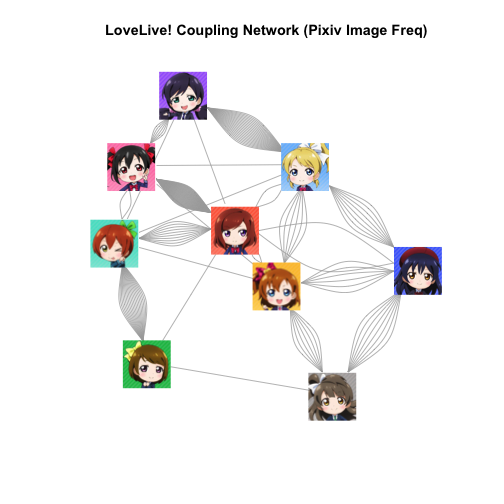

pixivで百合ネットワーク
===

## 概要 

pixivでカップリング画像の投稿数からネットワーク作って遊びます.

今回は絵のほうです. 

pixivをスクレイプして, カップリング画像の投稿数を調べました. 


```r
library(data.table)
library(dplyr)
library(reshape2)
library(png)
```

## ネットワークの接続行列

pixivでカップリング名を検索. 投稿作品の数を調べました. 

"にこまき"が4630件で最大でした. 人気です. 

```r
dat = fread("./res.csv") %>% as.data.frame
## 投稿数ランキング
dat %>% arrange(desc(V3)) %>% head
```

```
##      V1   V2   V3
## 1 niko maki 4630
## 2 nozo  eri 1943
## 3  rin pana 1852
## 4  rin  rin 1083
## 5 koto  umi  781
## 6 koto hono  719
```

```r
mat = dat %>% xtabs(formula = V3 ~ .) %>% as.matrix
mat = mat + t(mat)
diag(mat) = 0
## 適当に割り算します
mat = mat / 100
mat
```

```
##       V2
## V1    eri  hono  koto  maki  niko  nozo  pana   rin   umi
##   eri   0.00  6.18  0.79  2.52  1.62 22.42  0.34  1.48  8.66
##   hono  6.18  0.00  7.86  2.95  1.15  0.32  0.17  1.04  6.60
##   koto  0.79  7.86  0.00  0.54  0.40  0.23  1.26  0.55  8.25
##   maki  2.52  2.95  0.54  0.00 47.02  1.29  1.45 10.77  2.90
##   niko  1.62  1.15  0.40 47.02  0.00  6.32  0.52  2.39  0.43
##   nozo 22.42  0.32  0.23  1.29  6.32  0.00  0.22  1.26  0.33
##   pana  0.34  0.17  1.26  1.45  0.52  0.22  0.00 18.65  0.09
##   rin   1.48  1.04  0.55 10.77  2.39  1.26 18.65  0.00  0.70
##   umi   8.66  6.60  8.25  2.90  0.43  0.33  0.09  0.70  0.00
```

にこまき, のぞえり, りんぱな, ことほのが強いですね. 

## グラフ作成

```r
library(igraph)
graph  = graph.adjacency(mat, mode="undirected")
set.seed(11)
V(graph)$size <- 30
V(graph)$color <- NA
V(graph)$frame.color <- NA
V(graph)$shape <- "square"
plot(graph, layout=layout.auto)
```

 

## 画像を載せる

文字だと寂しいので, 画像を載せます. 


```r
member_english = colnames(mat)
member_english
```

```
## [1] "eri"  "hono" "koto" "maki" "niko" "nozo" "pana" "rin"  "umi"
```

```r
pics = vector("list", 9)
for(i in 1:9){
  pics[[i]] = readPNG(paste("images/", member_english[i], ".png", sep=""), native=TRUE)
}
## なにこれ
ra = 1 
## これもわからん ピクセルが入るらしい
xy0 = pics %>% sapply(dim)
rownames(xy0) = c("height", "width")
## 拡大縮小率
s0 = 0.0025
```

ネットワークに画像を載せます.

```r
## 乱数の固定 グラフが固定されます. 
set.seed(11)

## グラフィカルパラメータの設定
V(graph)$size <- 30
V(graph)$color <- NA
V(graph)$frame.color <- NA
V(graph)$shape <- "square"
## plot. 配置は適当にやってもらう.
plot(graph, layout=layout.auto)
title("LoveLive! Coupling Network (Pixiv Image Freq)")

## plotにのせていく
## 最初は, 座標を取得する
print(member_english)
```

```
## [1] "eri"  "hono" "koto" "maki" "niko" "nozo" "pana" "rin"  "umi"
```

```r
# この順番に位置をクリックして, ESCする
# lay0 = locator()
# lay0に座標が入る. 
## 毎回やるのは面倒なので, 1回だけやって書き出しておく
#lay0 %>% write.table("layout.txt", row.names=FALSE, quote=FALSE)

## 前に取得しておいた座標を使う
lay0 = fread("layout.txt") %>% as.data.frame
for(i in 1:9){
  ## 位置を指定
  ## locatorで指定した位置が, 画像の中心座標となります.
  ## あとは, 4隅の座標を計算してあげます
  xleft=lay0[i, 1]*ra - xy0[2, i]/2*s0
    ybottom=lay0[i, 2]*ra - xy0[1, i]/2*s0
    xright=lay0[i, 1]*ra + xy0[2, i]/2*s0
    ytop=lay0[i, 2]*ra + xy0[1, i]/2*s0
  ## 指定した画像を載せます
    rasterImage(image=pics[[i]], xleft=xleft, ybottom=ybottom, xright=xright, ytop=ytop, xpd=TRUE)
}
```

 


## ネットワークの特徴量


```r
mat = mat * 100
graph  = graph.adjacency(mat, mode="undirected")
## ページランク
page.rank(graph)
```

```
## $vector
##     eri    hono    koto    maki    niko    nozo    pana     rin     umi 
## 0.13201 0.08823 0.07208 0.17855 0.15292 0.09679 0.07491 0.11132 0.09318 
## 
## $value
## [1] 1
## 
## $options
## NULL
```

```r
## 次数
degree(graph)
```

```
##  eri hono koto maki niko nozo pana  rin  umi 
## 4401 2626 1988 6944 5984 3239 2269 3683 2796
```

```r
## 接近性
closeness(graph)
```

```
##   eri  hono  koto  maki  niko  nozo  pana   rin   umi 
## 0.125 0.125 0.125 0.125 0.125 0.125 0.125 0.125 0.125
```

```r
## 固有ベクトル
evcent(graph)$vector
```

```
##     eri    hono    koto    maki    niko    nozo    pana     rin     umi 
## 0.24789 0.14748 0.07609 1.00000 0.97492 0.26352 0.16376 0.33283 0.14367
```

```r
## ボナチッチのべき乗法?
bonpow(graph)
```

```
##     eri    hono    koto    maki    niko    nozo    pana     rin     umi 
## -1.0001 -1.0002 -1.0000 -0.9998 -0.9997 -0.9997 -1.0000 -1.0002 -1.0003
```

## コミュニティ抽出
多重グラフでコミュニティ抽出したい...

```r
ll_graph= spinglass.community(graph)

modularity(ll_graph)
```

```
## [1] 0.002118
```

```r
membership(ll_graph)
```

```
##  eri hono koto maki niko nozo pana  rin  umi 
##    1    1    1    1    1    1    1    1    1
```

0-1の接続行列なら,　こんな感じで検出できるのに. 

```r
karate = graph.famous("Zachary")
wc = walktrap.community(karate)
          
modularity(wc)
```

```
## [1] 0.3532
```

```r
membership(wc)
```

```
##  [1] 1 1 2 1 5 5 5 1 2 2 5 1 1 2 3 3 5 1 3 1 3 1 3 4 4 4 3 4 2 3 2 2 3 3
```

```r
plot(wc, karate)
```

 

```r
scrape
```

```
## Error: オブジェクト 'scrape' がありません
```


```r
sessionInfo()
```

```
## R version 3.1.0 (2014-04-10)
## Platform: x86_64-apple-darwin10.8.0 (64-bit)
## 
## locale:
## [1] ja_JP.UTF-8/ja_JP.UTF-8/ja_JP.UTF-8/C/ja_JP.UTF-8/ja_JP.UTF-8
## 
## attached base packages:
## [1] stats     graphics  grDevices utils     datasets  methods   base     
## 
## other attached packages:
## [1] igraph_0.7.1     png_0.1-7        reshape2_1.4     dplyr_0.3.0.2   
## [5] data.table_1.9.2 knitr_1.6       
## 
## loaded via a namespace (and not attached):
##  [1] assertthat_0.1  DBI_0.3.0       evaluate_0.5.5  formatR_1.0    
##  [5] grid_3.1.0      lattice_0.20-29 lazyeval_0.1.9  magrittr_1.0.1 
##  [9] Matrix_1.1-4    parallel_3.1.0  plyr_1.8.1      Rcpp_0.11.2    
## [13] stringr_0.6.2   tools_3.1.0
```

