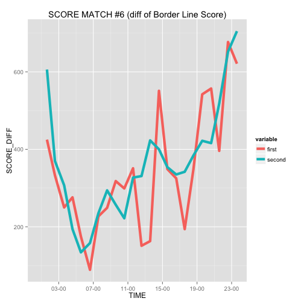

スコアマッチのボーダーライン推移
===

スクフェスのイベントで, ボーダーラインの時間推移データを使って遊びたいです. 

## データ読み込み


```r
library(data.table)
library(dplyr)
library(ggplot2)
dat = fread("LoveLive_score_modified.csv")

## データ型の修正 
dat = dat %>% 
  mutate(first = as.integer(first), 
         second =as.integer(second), 
         created=as.POSIXct(created, tz = "Asia/Tokyo"))
dat_score_match = 
  dat %>% 
  select(event) %>% 
  unique %>% 
  mutate(score_match = c(0,1,0,1,1,0,0,1,0,1))
```

スコアマッチだけ取り出す. 

```r
dat_scoreMatch = 
  dat %>% merge(dat_score_match, by = "event") %>% 
  filter(score_match == 1) %>% 
  mutate(event_number = substr(event, start=2,stop=3))
```

## 第06回のボーダー推移
第06回だけ取り出してプロット. 
ボーダーのデータは, 3月9日から最終日の3月15日までとれています.  
2枚取りと1枚取りのボーダー推移を線グラフで描きます.

```r
library(reshape2)
## 第6回だけ取り出してデータフレームを変形
## タイムゾーンがGMTだったので, JSTに直すために+9時間する
dat_scoreMatch_06 = 
  dat_scoreMatch %>% 
  filter(event_number == "06") %>% 
  select(event_number, first , second, created) %>% 
  melt(id.var = c("event_number", "created")) %>% 
  mutate(DATE = as.POSIXct(created, tz ="Asia/Tokyo")+60*60*9) %>% 
  arrange(DATE)
## 内容
dat_scoreMatch_06
```

```
##      event_number             created variable  value                DATE
##   1:           06 2014-03-09 03:36:15    first  46514 2014-03-09 12:36:15
##   2:           06 2014-03-09 03:36:15   second  25572 2014-03-09 12:36:15
##   3:           06 2014-03-09 04:35:19    first  46915 2014-03-09 13:35:19
##   4:           06 2014-03-09 04:35:19   second  25819 2014-03-09 13:35:19
##   5:           06 2014-03-09 05:34:43    first  47401 2014-03-09 14:34:43
##  ---                                                                     
## 288:           06 2014-03-15 02:37:27   second  71476 2014-03-15 11:37:27
## 289:           06 2014-03-15 03:33:58    first 102415 2014-03-15 12:33:58
## 290:           06 2014-03-15 03:33:58   second  73105 2014-03-15 12:33:58
## 291:           06 2014-03-15 04:36:02    first 104414 2014-03-15 13:36:02
## 292:           06 2014-03-15 04:36:02   second  75212 2014-03-15 13:36:02
```

```r
## 時間推移をggplot
library(scales)
dat_scoreMatch_06 %>% 
  ggplot(aes(x=DATE, y=value)) + 
  geom_line(aes(color=variable), size = 2) + 
  scale_x_datetime(breaks=date_breaks("24 hours"), 
                   labels = date_format("%m-%d")) + 
  ggtitle("SCORE MATCH #6 (Border Line Score)")
```

 

時間軸がおかしい気がしますね...

夜に傾きが変わっていますね. 仕事終わりにシャンシャンしているのでしょう.
最終日の伸びが怖いです.

次に, ボーダーラインの変化分だけ見ます. 

```r
dat_scoreMatch_06 %>% 
  group_by(variable) %>% 
  mutate(value_diff = c(NA, diff(value))) %>% 
  ggplot(aes(x=DATE, y=value_diff)) +
  geom_line(aes(color=variable), size=1) + 
  scale_x_datetime(breaks=date_breaks("24 hours"), 
                   labels = date_format("%m:%d")) + 
  ggtitle("SCORE MATCH #6 (diff of Border Line Score)")
```

```
## Warning: Removed 2 rows containing missing values (geom_path).
```

 

最終日ヤバい.
1時間ごとのデータなので, 1時間で2000ポイントですか. 

## 24時間のスコア推移

1日のスコア推移も気になります. 例えば, 3月13日の木曜日.

```r
dat_scoreMatch_06 %>%
  mutate(DAY = substr(DATE, 1,10)) %>%
  filter(DAY == "2014-03-13") %>%
  mutate(HOUR = substr(DATE, 12,19)) %>%
  arrange(HOUR) %>% 
  group_by(variable, add=FALSE) %>% 
  mutate(value_diff = c(NA, diff(value))) %>% 
  ggplot(aes(x=as.POSIXct(HOUR, format="%H:%M:%S"), y=value_diff)) + 
  geom_line(aes(color=variable), size=2) + 
  scale_x_datetime(breaks=date_breaks("4 hours"), 
                   labels = date_format("%H-%M")) + 
  ggtitle("SCORE MATCH #6 (diff of Border Line Score)") + 
  xlab("TIME") + ylab("SCORE_DIFF")
```

```
## Warning: Removed 2 rows containing missing values (geom_path).
```

 

1枚取りボーダーでは, 早朝の伸びが甘いです. 
2枚どりボーダーは着実に上がっています. すごい. 
そして深夜帯にシャンシャンして寝るんでしょうかね. 


## まとめ
とりあえずデータが取れたので, 可視化してみました. 
時間データでggplotしていますが, 何かがおかしい気がします. 

## 発展
ボーダーの推移を何かしらのモデルを使って表現して,　予測できたら嬉しいですね. 

